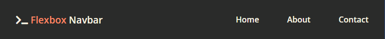
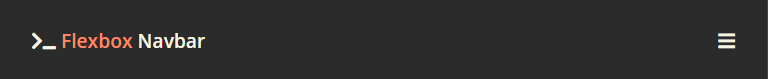
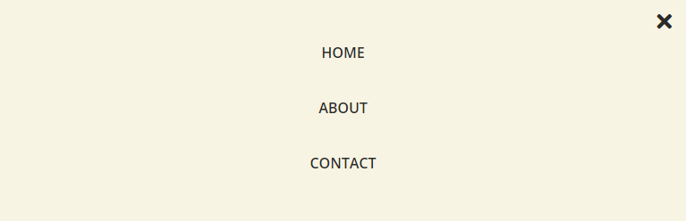

# Responsive Navbar

This is a work in progress about how to create a basic responsive navbar using technologies like HTML, CSS and JavaScript

The aim of this project is share and learn knowledge about this stuff, so **pull request and comments are welcome**

Here are three little images about how looks like the navbar

## Desktop layout 🖥

## Mobile layout 📱
### Hamburger

### Menu

Let me know what you think about that and if you think that this little stuffs can help your company, contact me at [email](mailto:mariopaciosmartinez@gmail.com)